# 🍕 Pizza Sales Analysis — MySQL

## 📌 Project Overview

This project analyzes pizza sales data using **MySQL** to uncover key business insights related to sales, revenue, customer ordering patterns, pizza performance, and product categories.

The project progresses from basic SQL queries and aggregations to more advanced SQL concepts such as:

- Filtering and sorting
- Aggregate functions
- GROUP BY
- JOINs
- Subqueries
- Window functions
- Ranking
- Cumulative calculations
- Business-oriented data analysis

---

## 🎯 Business Questions

The analysis answers **13 key business questions**:

1. What is the total number of orders placed?
2. What is the total revenue generated from pizza sales?
3. What is the total quantity of pizzas sold by category?
4. What is the average number of pizzas ordered per day?
5. What is the most commonly ordered pizza size?
6. What are the top 5 most ordered pizza types?
7. What percentage of total revenue does each pizza category contribute?
8. What are the top 3 pizza types based on revenue?
9. What are the top 3 pizza types by revenue within each category?
10. Which pizza has the highest price?
11. How are orders distributed throughout the day by hour?
12. How does cumulative revenue change over time?
13. What is the category-wise distribution of pizzas?

---

## 🛠️ Tools & Technologies

- **MySQL**
- **SQL**
- MySQL Workbench
- GitHub

### SQL Concepts Used

```text
SELECT
WHERE
ORDER BY
GROUP BY
HAVING
COUNT()
SUM()
AVG()
MAX()
JOIN
Subqueries
Window Functions
RANK()
Aggregate Functions
Date Functions
```

---

## 📂 Project Structure

```text
Pizza-sales---mySQL-
│
├── README.md
├── pizza_sales_analysis.sql
│
├── data/
│   └── Dataset files
│
└── images/
    ├── average_pizzas_ordered_per_day.png
    ├── category_wise_distribution_of_pizzas.png
    ├── cumulative_revenue_over_time.png
    ├── highest_priced_pizza.png
    ├── most_common_pizza_size_ordered.png
    ├── order_distribution_by_hour.png
    ├── revenue_contribution_by_category.png
    ├── top_3_pizza_types_by_revenue.png
    ├── top_3_pizza_types_by_revenue_per_category.png
    ├── top_5_most_ordered_pizza_types.png
    ├── total_orders_placed.png
    ├── total_quantity_by_pizza_category.png
    └── total_revenue_from_pizza_sales.png
```

---

# 📊 Analysis & Results

## 1. Basic Sales Analysis

### Total Orders • Total Revenue • Total Quantity • Average Daily Orders

<table>
  <tr>
    <td align="center"><b>Total Orders Placed</b><br><br>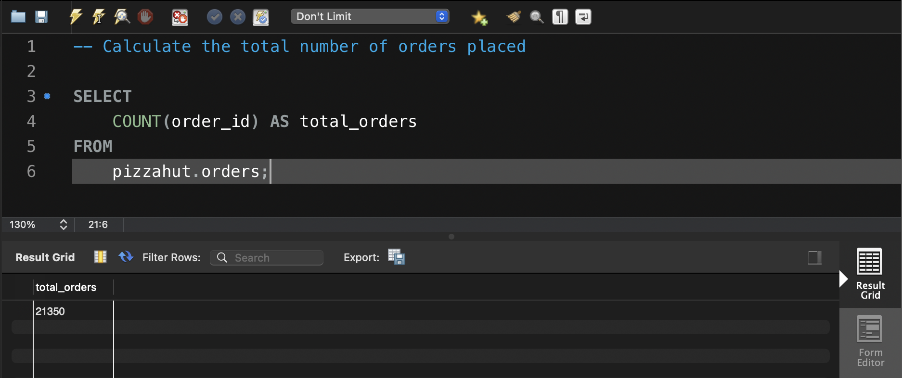</td>
    <td align="center"><b>Total Revenue from Pizza Sales</b><br><br>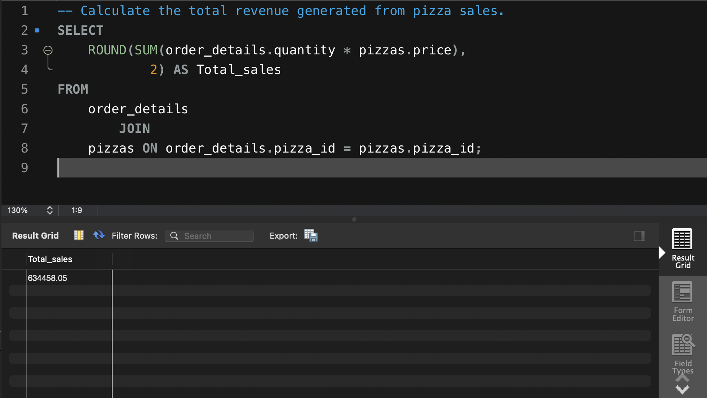</td>
  </tr>
  <tr>
    <td align="center"><b>Total Quantity by Pizza Category</b><br><br>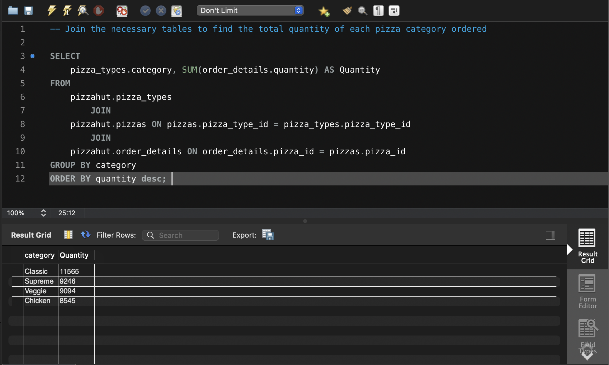</td>
    <td align="center"><b>Average Pizzas Ordered per Day</b><br><br>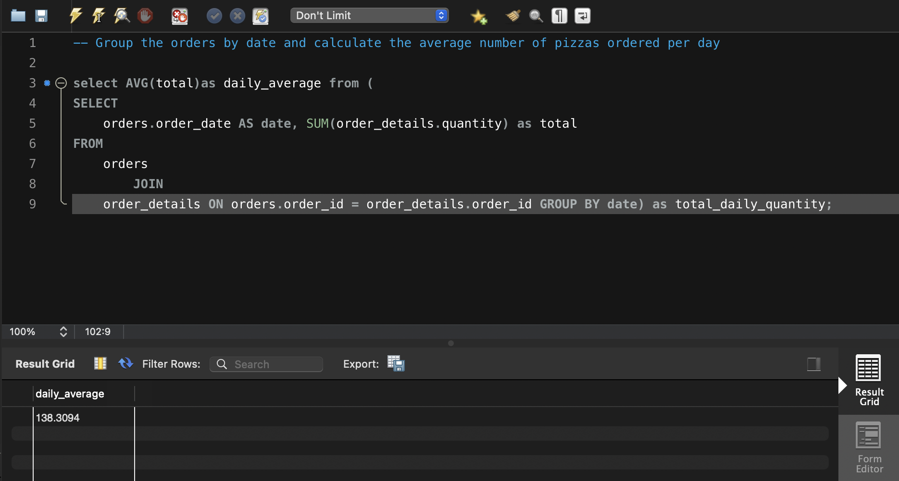</td>
  </tr>
</table>

---

## 2. Pizza & Category Analysis

### Understanding customer preferences and product distribution

<table>
  <tr>
    <td align="center"><b>Most Common Pizza Size Ordered</b><br><br>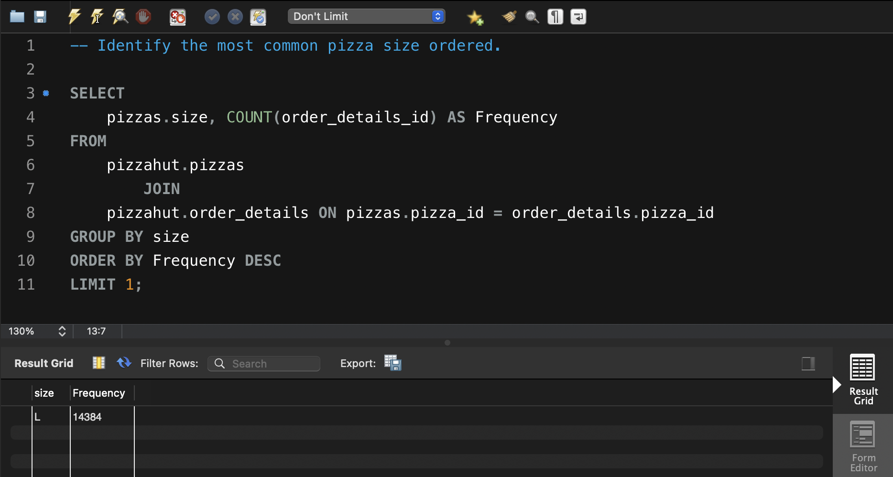</td>
    <td align="center"><b>Top 5 Most Ordered Pizza Types</b><br><br>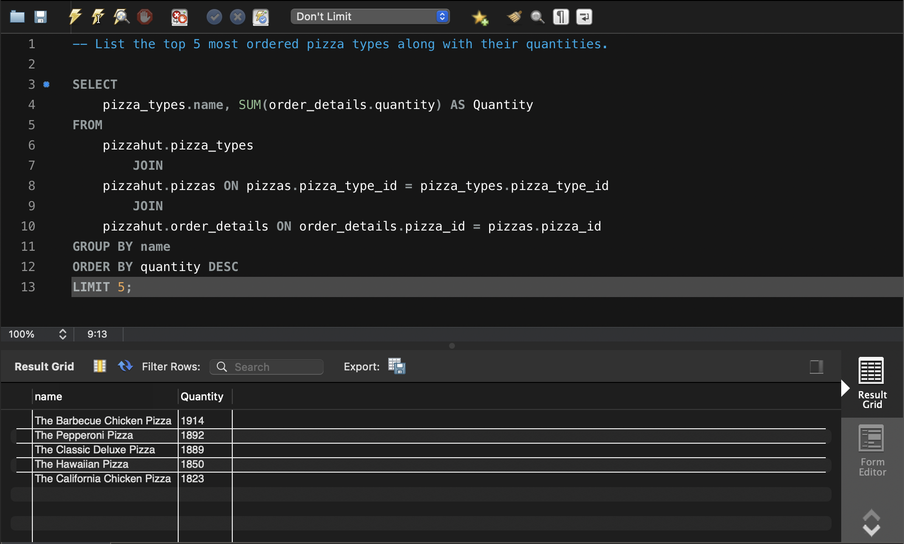</td>
  </tr>
  <tr>
    <td align="center"><b>Revenue Contribution by Category</b><br><br>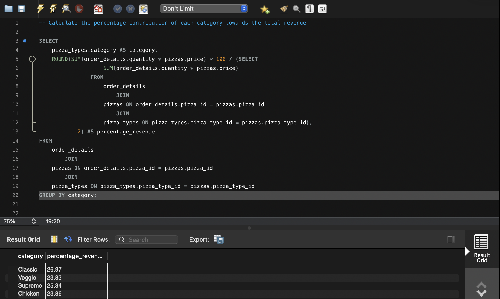</td>
    <td align="center"><b>Category-wise Distribution of Pizzas</b><br><br>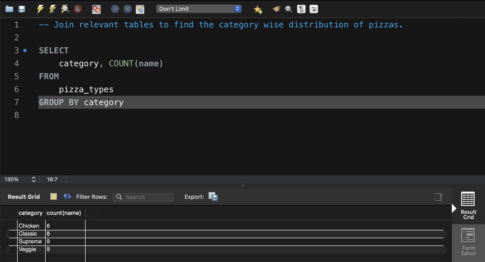</td>
  </tr>
</table>

---

## 3. Product Performance Analysis

### Identifying the highest-performing pizza products

<table>
  <tr>
    <td align="center"><b>Top 3 Pizza Types by Revenue</b><br><br>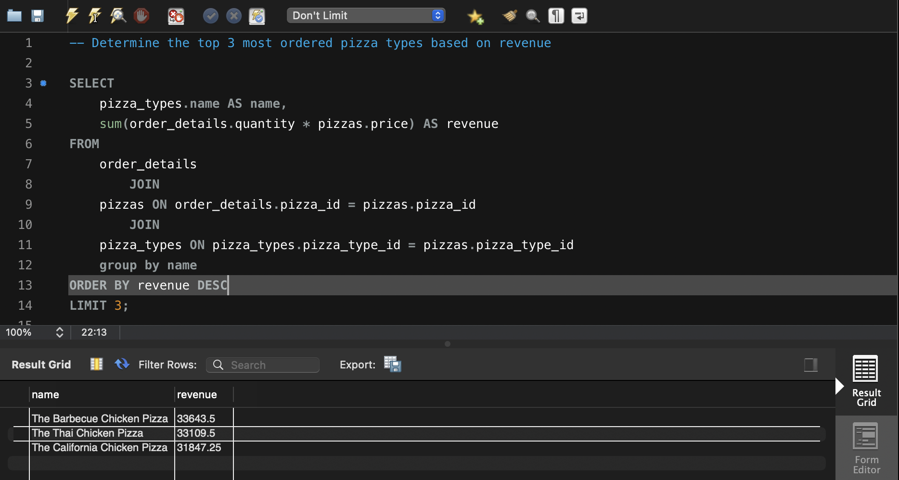</td>
    <td align="center"><b>Top 3 Pizza Types by Revenue per Category</b><br><br>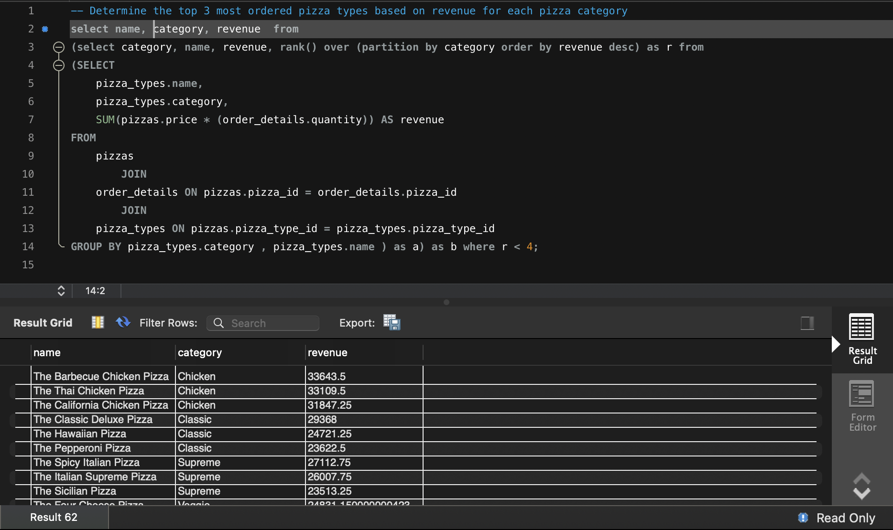</td>
  </tr>
  <tr>
    <td align="center"><b>Highest Priced Pizza</b><br><br>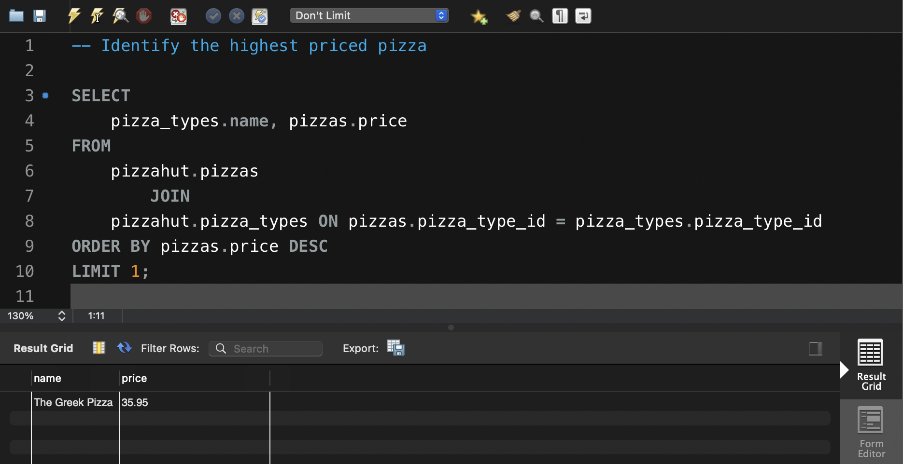</td>
    <td align="center"><b>Order Distribution by Hour</b><br><br>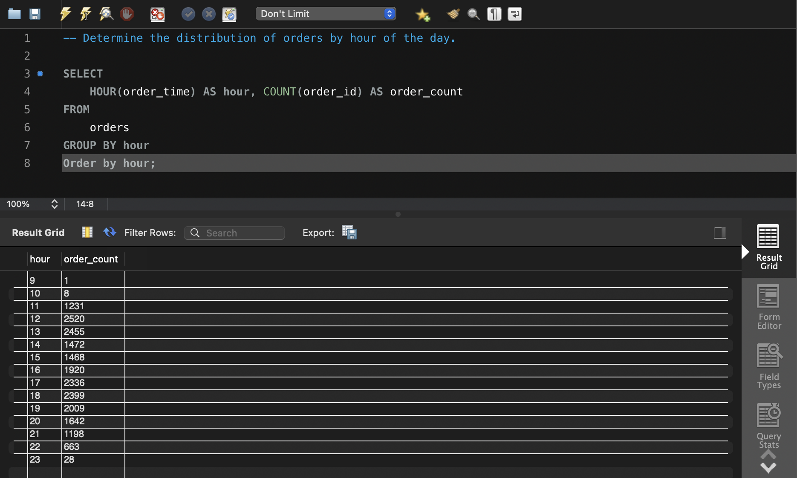</td>
  </tr>
</table>

---

## 4. Revenue Trend Analysis

### Cumulative Revenue Over Time

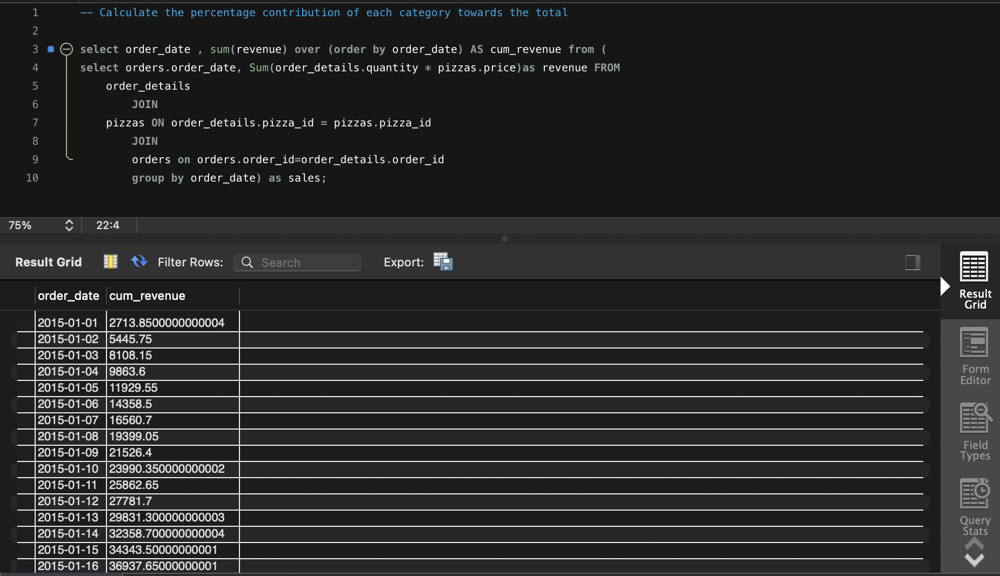

The cumulative revenue analysis uses a **window function** to calculate how total revenue builds over time.

---

# 💡 Key SQL Techniques Demonstrated

### 🔹 Aggregations

Used functions such as:

```sql
COUNT()
SUM()
AVG()
MAX()
```

to calculate important sales metrics.

### 🔹 JOINs

Multiple tables are joined to combine information about:

- Orders
- Order details
- Pizza products
- Pizza categories

### 🔹 GROUP BY

Used to analyze sales across different dimensions such as:

- Pizza category
- Pizza type
- Order date
- Pizza size

### 🔹 Subqueries

Used for calculations that require comparing individual results against overall totals.

### 🔹 Window Functions

Window functions were used for advanced analysis such as:

```sql
RANK() OVER (...)
```

and cumulative revenue calculations.

---

# 📁 Dataset

The project uses a relational pizza sales dataset containing information about:

- Orders
- Order details
- Pizza products
- Pizza types
- Pizza categories
- Pizza prices
- Pizza sizes

The dataset is stored inside the `data/` directory.

---

# 🚀 How to Run the Project

### 1. Clone the repository

```bash
git clone https://github.com/shubh-014/Pizza-sales---mySQL-.git
```

### 2. Open MySQL Workbench

Create or select a database for the project.

### 3. Load the dataset

Import the dataset files from the `data/` folder into the appropriate tables.

### 4. Run the SQL analysis

Open:

```text
pizza_sales_analysis.sql
```

and execute the queries in MySQL Workbench.

### 5. Explore the results

The `images/` folder contains screenshots of the SQL query results and analysis.

---

# 📈 Project Outcome

This project demonstrates how SQL can be used to transform raw transactional data into meaningful business insights.

The analysis covers the complete workflow from:

**Raw Data → SQL Queries → Aggregations → Advanced Analysis → Business Insights**

It also demonstrates practical use of MySQL for data analyst tasks involving sales performance, product analysis, customer ordering behavior, and revenue trends.

---

## 👨‍💻 Author

**Shubh Gupta**

This project was created to demonstrate database management skills.
